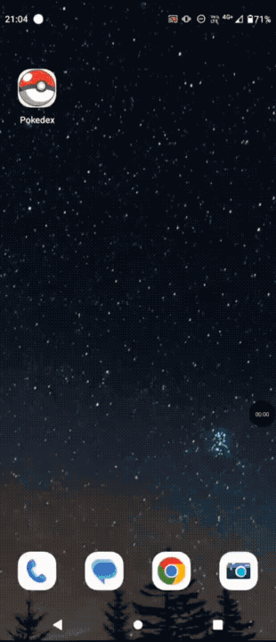

# muckChallengePokedex

Pokédex en React Native CLI: lista los Pokémon de [PokéAPI](https://pokeapi.co), abre una ficha de detalle y funciona de forma parcial sin red una vez cacheada.



[Video que muestra el funcionamiento de la app](src/assets/video.mp4)

## Requisitos

- Node.js `>= 22.11.0`
- Entorno nativo según la [guía de React Native](https://reactnative.dev/docs/set-up-your-environment)

## Instalar y ejecutar

```sh
npm install
npm start
```

En otra terminal:

```sh
npm run android
# o
npm run ios
```

En iOS, la primera vez:

```sh
bundle install
bundle exec pod install
```

## Pruebas

```sh
npm test
npm run lint
npm run typecheck
```

CI (GitHub Actions) corre lint, `tsc --noEmit` y Jest en cada push/PR.

## Arquitectura

Clean Architecture justificada por motivos de cambio distintos. Los tipos de dominio se leen en `src/domain`; no hay carpetas `models/` / `enums/` aparte.

| Carpeta | Qué hay |
|---|---|
| `src/domain` | Entidades (`Pokemon`, `PokemonDetail`), catálogo (`PokemonType`, `StatName`, …), puertos (`PokemonRepository`, `HttpClient`, `CacheStore`) y `AppError`. Sin React ni fetch. |
| `src/application` | Casos de uso (`ListPokemon`, `GetPokemon`). Reciben el repositorio por constructor. |
| `src/infrastructure` | Adapters: HTTP, caché persistente y mapeo de PokéAPI. |
| `src/presentation` | UI, hooks y pantallas. Sin URLs de API. |
| `src/di` | Composition root. Instancia concreta; los hooks piden casos de uso por context, no importan el container. |
| `src/navigation` | Stack propio y señal de recarga. |

```
presentation / navigation  →  application  →  domain
         ↑                         ↑
         └── di (composition) ─────┘
                   ↓
            infrastructure
```

`App.tsx` arma providers (casos de uso, navegación, ErrorBoundary) y deja el navigator montar pantallas.

### Cómo leer el código

Orden sugerido si es la primera vez en el repo:

1. `App.tsx` y `src/di/container.ts` — composition: qué se instancia y por qué hay dos cachés.
2. `src/domain` — modelo y puertos. Sin React ni URLs.
3. `src/application` — casos de uso; reciben el repositorio por constructor.
4. `src/infrastructure` — PokéAPI, HTTP y persistencia.
5. `src/navigation` — stack propio y señal de recarga.
6. `src/presentation` — hooks de vista y pantallas.

Los comentarios en el código explican **por qué** se eligió ese diseño, no qué hace cada línea.

### Decisiones

- **CLI, no Expo:** el enunciado admite ambos; CLI deja el runtime más cerca de lo que React Native provee (fetch, BackHandler, FlatList) sin capa extra.
- **Sin React Navigation ni React Query:** el stack y el fetching caben en unos pocos archivos; una lib externa chocaría con la restricción del challenge.
- **Dos capas de caché:** una cachea JSON crudo por URL; la otra el modelo de dominio con TTL y fallback offline. No se unifican porque el motivo de cambio es distinto.

## Dependencias

El enunciado pide no usar librerías externas. Runtime:

| Paquete | Rol |
|---|---|
| `react` / `react-native` | UI y runtime. Obligatorio. |
| `@react-native-async-storage/async-storage` | Única excepción. React Native **ya no incluye** un KV persistente (AsyncStorage salió del core). Sin esto no hay offline entre sesiones. Los payloads son JSON chico (listados y fichas); la política de TTL y el fallback viven en `CachedPokemonRepository`, no en el I/O. |

Tooling (no va al binario): TypeScript, Jest, ESLint, Prettier.

No hay Axios, React Query, React Navigation ni Expo.

## Caché (dos capas a propósito)

1. **HTTP de sesión** (`CachingHttpClient`): el listado ya pidió `/pokemon/{id}` y la ficha lo vuelve a necesitar; varias fichas comparten `/ability/{name}`. Vive en memoria y muere al cerrar la app.
2. **Agregado persistente** (`CachedPokemonRepository` + `AsyncStorage`): listados y fichas ya mapeados, TTL 24 h. Si la red falla, se sirve el dato previo aunque esté vencido (offline parcial).

Los **sprites no se persisten**: salen del CDN de GitHub. Sin red, los textos de una ficha ya vista siguen disponibles y la UI muestra una Pokébola si la imagen no carga.

## Navigator propio

El stack vive en memoria (`Home` → `ficha` → `Error`) y las pantallas previas quedan montadas con `display: none`. Así, volver desde la ficha no re-pide las 20 cards ni pierde el scroll. El hardware back en Android está cableado a `goBack` / `retry`.


## Trade-offs y pendientes

- Offline parcial: textos cacheados, sprites del CDN. Persistir imágenes exigiría otra lib o un store de archivos.
- Navigator propio: no hay deep links ni historial nativo del sistema. Si el stack creciera, habría que replantearlo.
- HTTP y caché usan `as T` en el JSON: sin validador runtime (Zod sería otra lib). El adapter filtra vocabularios desconocidos (tipo, stat, hábitat, grupo huevo).

## Accesibilidad

Checklist rápido con TalkBack (Android) o VoiceOver (iOS):

- El listado anuncia cada card (“Ver ficha de …”) y el hint de abrir ficha.
- Carga inicial: “Cargando Pokédex…”. Carga de ficha: “Cargando ficha…”.
- Error y vacío se anuncian como alerta; Reintentar es un botón de 44 dp.
- Volver desde la ficha: “Volver al listado”.
- Las pantallas detrás del stack quedan ocultas al lector.
- Los colores de tipo están oscurecidos para contraste AA del texto blanco.
- Reduce Motion desactiva el pulse del skeleton y el fade del listado.
